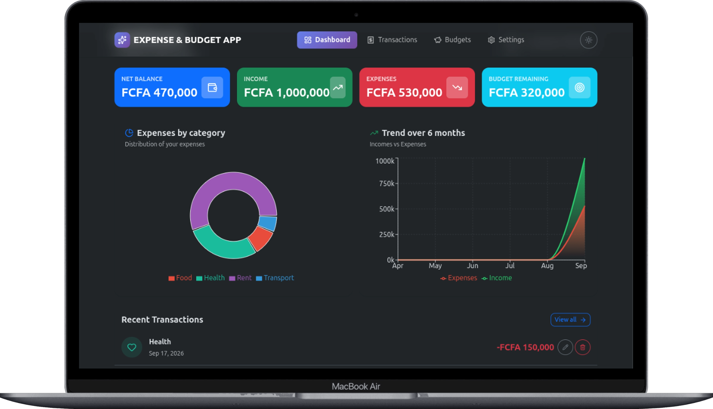
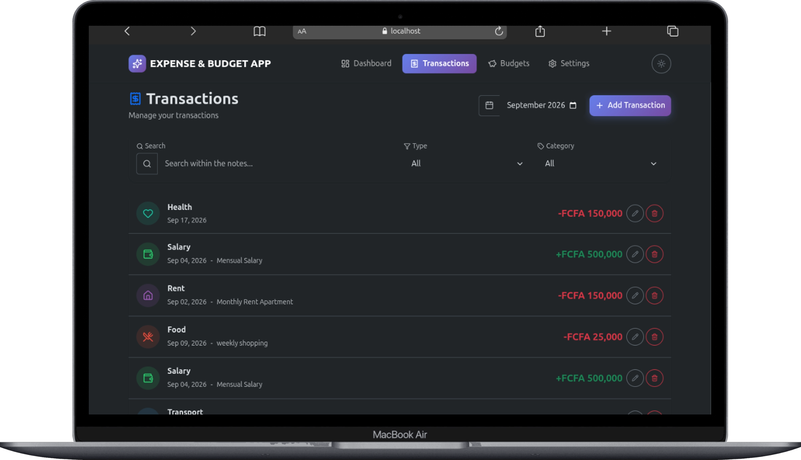
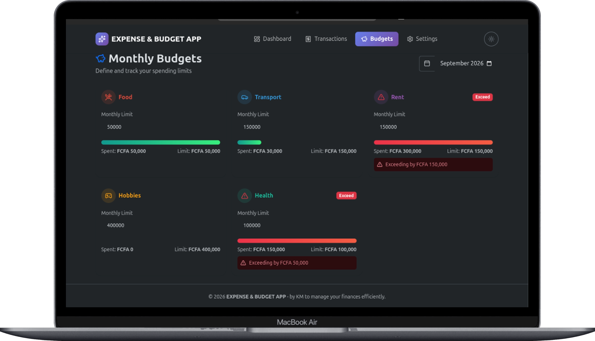
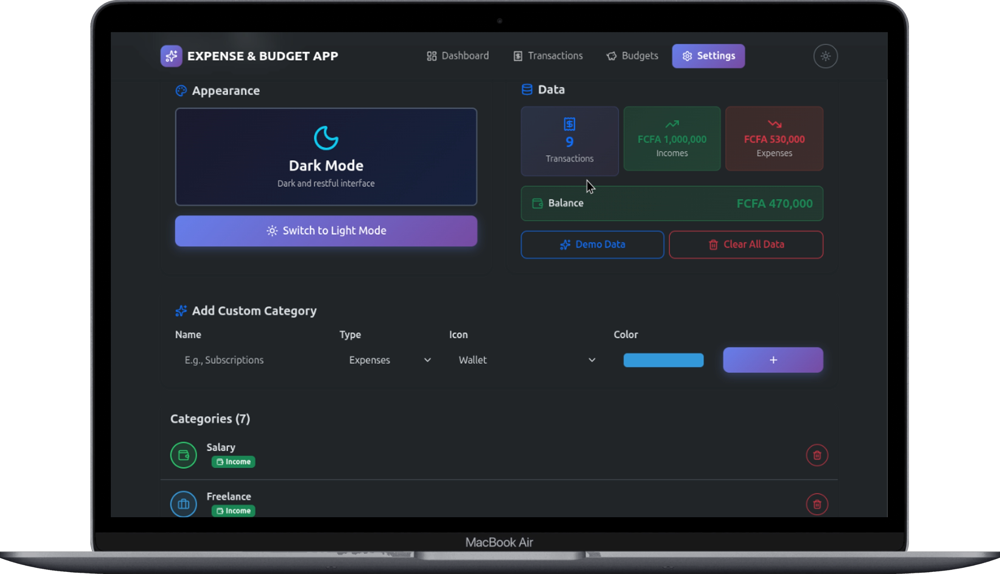
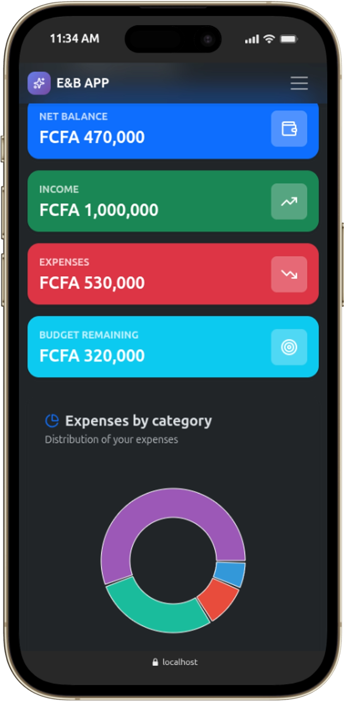
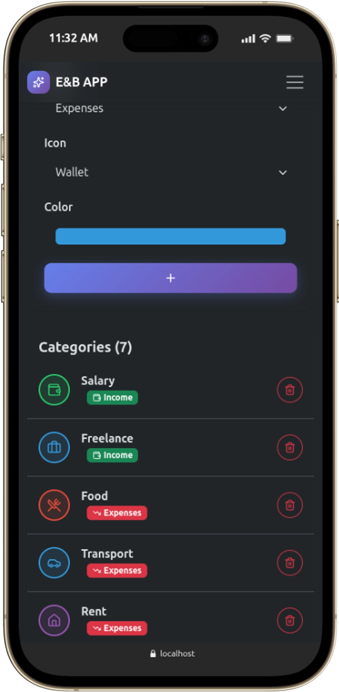

# 💰 Expense & Budget Tracker - React Personal Finance Application

A fully functional personal finance application built with **React, Vite, and Bootstrap**. Users can add, track, and visualize their income and expenses, set monthly budgets per category, and explore interactive charts - with data persistence using `localStorage` and a light/dark theme.

---

## 🎯 Project Goals

This project aims to:

- Build a **modern React** with function components only
- Implement **global state management** using the Context API + custom hooks
- Integrate **Recharts** for interactive data visualization
- Build a **fully responsive** interface with Bootstrap 5.3
- Persist all data (transactions, categories, budgets, theme) in `localStorage`
- Handle mathematical operations and data aggregation efficiently using `useMemo` and `reduce`

---

## 🚀 Key Features

### ➕ Add / Edit / Delete Transactions

- Add a transaction with **type** (income/expense), **amount**, **category**, **date**, and optional **note**
- Inline validation blocks invalid entries (amount > 0, required fields)
- Edit or delete any transaction

### 📊 Real-time Summary

- Displays **Total Balance**, **Total Income**, and **Total Expenses** for the selected month
- Amounts formatted with `Intl.NumberFormat` in **FCFA (XOF)**
- Dynamic color coding (Green for income, Red for expenses, Blue for balance)
- **Budget remaining** indicator

### 🗂️ Categories

- Ships with sensible defaults (Salary, Food, Transport, Rent, Entertainment, Health…)
- Each category has a **name**, **color**, and **Lucide icon**
- Users can **add custom categories** and pick their color/icon
- Categories separated by type (income vs. expense)

### 🔍 Filtering & Search

- Filter transactions by **month**
- Filter by **type** (All / Income / Expense) and **category**
- Empty state displayed when no results match

### 💰 Monthly Budgets

- Set a **monthly budget per category**
- Visual **progress bar** showing spent vs. limit
- **Red bar + warning** when a category is over budget
- Budgets scoped to the selected month

### Data Visualization (Recharts)

- **Donut chart**: spending by category for the selected month
- **Area chart**: income vs. expenses evolution over the last 6 months
- Charts update reactively when the month or data changes
- Empty state when there's no data to chart

### 🌗 Light / Dark Theme

- Toggle between light and dark mode
- Native Bootstrap 5.3 `data-bs-theme` integration

### 💾 Local Storage Persistence

- All data (transactions, custom categories, budgets, theme, selected month) saved in the browser
- Data survives a full page refresh

---

## ️ Tech Stack

### Languages & Frameworks

- **React 18** (function components only)
- **Vite** (fast build tooling)
- **React Router** (client-side routing)
- **Bootstrap 5.3** (responsive grid, dark mode, components)
- **Custom CSS** (gradients, animations, glassmorphism)

### Libraries

- **Recharts**
- **lucide-react** - consistent icon set
- **Oxlint**

---

## 📐 Responsive Breakpoints

| Breakpoint | Target Device |
| --- | --- |
| ≤ 576px | Mobile phones |
| 577px - 991px | Tablets |
| ≥ 992px | Desktops |

---

## 📷 Page Preview

### Desktop View

| Dashboard | Transactions | Budgets | Settings |
| --- | --- | --- | --- |
|  |  |  |  |

### Mobile View

| Mobile Dashboard | Mobile Transactions |
| --- | --- |
|  |  |

---

## Project Structure

```text
expense-and-budget-tracker-app/
── public/
├── src
│   ├── assets
        ├── images
│   │   │   ├── d-budget.png
│   │   │   ├── d-dashboard.png
│   │   │   ├── d-setting.png
│   │   │   ├── d-transaction.png
│   │   │   ├── m-dashboard.png
│   │   │   └── m-setting.png
│   │   └── main.css
│   ├── components
│   │   ├── budgets
│   │   │   ├── BudgetCard.jsx
│   │   │   ├── BudgetForm.jsx
│   │   │   └── BudgetProgress.jsx
│   │   ├── common
│   │   │   ├── Button.jsx
│   │   │   ├── CategoryIcon.jsx
│   │   │   ├── ConfirmDialog.jsx
│   │   │   ├── EmptyState.jsx
│   │   │   ├── Modal.jsx
│   │   │   ├── SearchBar.jsx
│   │   │   └── Select.jsx
│   │   ├── dashboard
│   │   │   ├── CategoryChart.jsx
│   │   │   ├── MonthSelector.jsx
│   │   │   ├── SummaryCards.jsx
│   │   │   └── TrendChart.jsx
│   │   └── transactions
│   │       ├── TransactionFilters.jsx
│   │       ├── TransactionForm.jsx
│   │       ├── TransactionItem.jsx
│   │       └── TransactionList.jsx
│   ├── contexts
│   │   ├── BudgetsContext.jsx
│   │   ├── ThemeContext.jsx
│   │   └── TransactionsContext.jsx
│   ├── data
│   │   ├── categories.js
│   │   └── seed.js
│   ├── hooks
│   │   ├── useBudgets.js
│   │   ├── useDebounce.js
│   │   ├── useFilters.js
│   │   ├── useLocalStorage.js
│   │   ├── useTheme.js
│   │   └── useTransactions.js
│   ├── layouts
│   │   └── MainLayout.jsx
│   ├── pages
│   │   ├── BudgetsPage.jsx
│   │   ├── DashboardPage.jsx
│   │   ├── NotFoundPage.jsx
│   │   ├── SettingsPage.jsx
│   │   └── TransactionsPage.jsx
│   └── utils
│   │   ├── calculations.js
│   │   ├── constants.js
│   │   ├── formatCurrency.js
│   │   └── formatDate.js
│   ├── App.jsx
│   ├── main.jsx
│   ├── routes.jsx
├── .oxlintrc.json
├── index.html
├── package.json
├── package-lock.json
├── README.md
└── vite.config.js
```

---

## 🚀 Getting Started

### Prerequisites

- **Node.js** ≥ 18
- **npm** ≥ 9

### Installation

```bash
# Clone the repository
git clone https://github.com/mike2377/expense-and-budget-tracker-app.git

# Move into the project directory
cd expense-and-budget-tracker-app

# Install dependencies
npm install

# Start the development server
npm run dev
```

Open [http://localhost:5173](http://localhost:5173) in your browser.

### Useful Scripts

| Command | Description |
| --- | --- |
| `npm run dev` | Start Vite dev server |
| `npm run lint` | Run Oxlint |
| `npm run lint:fix` | Auto-fix lint issues |

---

## 🧠 Challenges Faced

### 1. `useMemo` Not Triggering on Array Changes

React compares array references, not content — so `useMemo(() => calculateTotals(transactions), [transactions])` sometimes skipped recalculations. **Solution**: used `JSON.stringify(transactions)` as the dependency to force recalculation on content change.

### 2. Timezone Bug in Trend Chart

Using `.toISOString().slice(0, 7)` caused transactions from the current month to be counted in the previous month (UTC vs. local time). **Solution**: switched to `getFullYear()` / `getMonth()` for local-time comparison.

### 3. `Intl.NumberFormat` Invalid Currency

`FCFA` is not a valid ISO 4217 code. **Solution**: used `XAF`, which renders as `FCFA 50 000`.

### 4. State Synchronization

Ensuring Summary, List, Charts, and Budgets always reflect the same data. **Solution**: a single `TransactionsContext` exposes derived state (`monthFilteredTransactions`) computed with `useMemo`, consumed by every page.

---

## 📚 What I Learned

- Mastering **React Context + custom hooks** for scalable state management without Redux
- Integrating **Recharts** for responsive, animated charts
- Writing **reusable hooks** (`useLocalStorage`, `useDebounce`, `useFilters`)
- Structuring a **large React project** with clear separation of concerns (`/components`, `/pages`, `/hooks`, `/contexts`, `/utils`, `/data`)
- Handling **responsive design** with Bootstrap 5.3 grid + custom media queries
- Using **Oxlint** as a fast, modern alternative to ESLint
- Formatting currency properly with `Intl.NumberFormat` instead of string concatenation
- Managing **empty states**, **validation errors**, and **confirmation dialogs** for a polished UX

---

## 🏽‍💻 Author

**Kembou Keumoe Ivan Michael**
Junior Fullstack Developer

📩 Email: [kman39457@email.com](mailto:kman39457@email.com)
🌍 Based in Cameroon | Open to remote opportunities
🔗 GitHub: [github.com/mike2377](https://github.com/mike2377)

---
